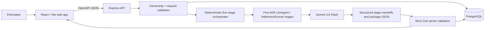

# Creative Crew architecture

## Implemented runtime

The browser never calls Gemini directly and never receives Google credentials
or private ADK session identifiers.

## Request path

1. `artifacts/creative-crew/src/pages/home.tsx` collects the brief and invokes
   the generated API client.
2. `artifacts/api-server/src/routes/creative-treatment.ts` validates the body
   and same-origin request, resolves guest/account ownership, and starts a
   durable generation record.
3. The same route sequentially creates five Google ADK `LlmAgent` /
   `InMemoryRunner` stages, creates stage sessions, and calls `runner.runAsync()`.
4. Creative Director → Writer → Art Director → Production Planner → Creative QA
   receive structured handoffs; Gemini returns JSON constrained by each schema.
5. The server deterministically assembles five workflow stages and one package,
   strictly validates it with Zod, then completes the durable project and returns
   an OpenAPI-validated response.
6. The web application renders the package or an explicit error state.

## Deterministic logic versus generated intelligence

### Deterministic application logic

- Request and response contracts
- Same-origin mutation checks
- Guest-cookie and Clerk account ownership
- Project claiming and owner-scoped reads
- Project/run/treatment persistence
- Timeout and failure-state handling
- Stage and assembled-package Zod structured-output validation
- Newest-first project and treatment-list ordering
- Non-blocking analytics allowlists

### Gemini-generated intelligence

Five sequential specialists generate the package:

- Creative Director: overview and treatment (title, logline, idea, emotion,
  tone, narrative, visual principles, audience promise, guardrails)
- Writer: script scenes
- Art Director: textual visual direction
- Production Planner: production plan and shot list
- Creative QA: status, checks, issues, corrections, and final package summary

## Structured project state

PostgreSQL is the durable boundary for projects, ownership, briefs, generation
state, private provider-session metadata, and validated JSONB
treatments/packages. The public project and treatment-list responses omit ADK
session data. Old treatment-only records remain readable.

The supported generation endpoint creates a new project with one package.
Although the read model can return multiple treatments newest-first, there is
currently no owner-authorized endpoint that creates another treatment for an
existing project. Multi-revision workflow claims are therefore outside this
release.

The package viewer exposes workflow milestones; project overview and treatment;
script scenes; textual visual direction; production plan and shot list; Creative
QA; and the final package summary. It conditionally renders old
treatment-only records without requiring their newer package fields.

The ADK runner itself is currently in-memory for one bounded request. Durable
session identity and completion state exist to support auditability and future
workflow expansion, but this release does not resume an interrupted ADK run.

## Ownership and account claiming

- `/` is a public guest workspace.
- Guests are scoped by a signed, HTTP-only workspace cookie.
- Signed-in requests are scoped by the verified Clerk account ID.
- Project/detail/treatment-list reads are owner-scoped; another owner's identifier
  returns not found.
- Claiming requires authentication, a valid browser workspace, same-origin JSON,
  and explicit confirmation.
- Claiming is additive and idempotent; existing project and treatment IDs remain
  unchanged.
- Auth changes clear user-scoped client state so account data cannot leak across
  sessions.

## Failure behavior

The API creates the durable project before calling Gemini. On provider,
validation, timeout, or persistence failure it records a failed generation and
returns an explicit non-success response. The client keeps the brief available
for retry and does not render fixture content.

## Interfaces and source map

| Concern | Source |
|---|---|
| Google ADK/Gemini runtime | `artifacts/api-server/src/routes/creative-treatment.ts` |
| Express composition/security headers | `artifacts/api-server/src/app.ts` |
| Persistence repository | `artifacts/api-server/src/lib/creative-project-repository.ts` |
| Database schema | `lib/db/src/schema/creative.ts` |
| OpenAPI contract | `lib/api-spec/openapi.yaml` |
| Generated validation | `lib/api-zod/src/generated/api.ts` |
| Generated React client | `lib/api-client-react/src/generated/api.ts` |
| Main workflow UI | `artifacts/creative-crew/src/pages/home.tsx` |
| Persisted-treatment UI | `artifacts/creative-crew/src/components/treatment-history.tsx` |
| Analytics boundary | `artifacts/creative-crew/src/lib/analytics.ts` |

## Required runtime configuration

- `GOOGLE_API_KEY`
- `SESSION_SECRET`
- `DATABASE_URL`
- Clerk server and publishable configuration for optional account access
- Node.js 24.13 or later
- Gemini quota or billing availability

All secrets are server-side. The browser receives only Clerk's intentionally
public publishable configuration.

## Scope boundary

This release implements real brief → deterministic orchestrator → five
sequential Google ADK specialists → Gemini → validated, persisted
pre-production package. Image/storyboard generation, autonomous correction,
exports, sophisticated revision workflow, and production deployment are
intentionally deferred.